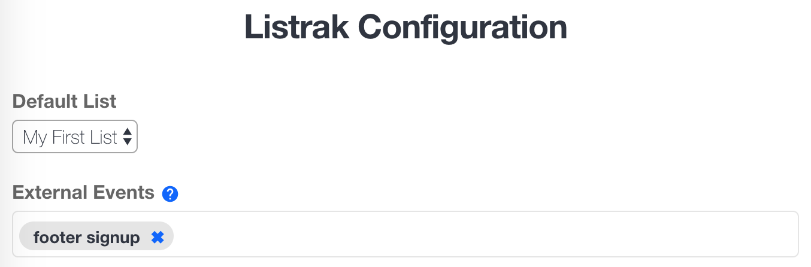

Workarea Listrak
================================================================================

Integrate the [Listrak][] ERP with the Workarea platform. This plugin
currently implements the following Listrak features:

- Page view tracking
- Cart abandonment
- Transactional email delivery
- Automatically subscribing users to a distribution list

Getting Started
--------------------------------------------------------------------------------

Add the gem to your application's Gemfile:

```ruby
# ...
gem 'workarea-listrak'
# ...
```

Update your application's bundle.

```bash
cd path/to/application
bundle
```

Update your `config/secrets.yml` file with your api credentials:

```yaml
listrak:
  data_api:
    client_id:
    client_secret:
  email_api:
    client_id:
    client_secret:
```

Configuration
--------------------------------------------------------------------------------

Most listrak configuration is set via the admin; you will need to set the
`Default List` in the admin after installing the plugin.



```ruby
Workarea.config do |config|
  config.listrak.analytics = {
    merchant_id: 'LISTRAK MERCHANT ID',
    email_capture_ids: 'EMAIL FIELD IDS USED FOR JAVASCRIPT ABANDONMENT'
  }
end
```

Subscribing email addresses to a distribution list
--------------------------------------------------------------------------------

When customers sign up for the newsletter within the popup dialog or
create a new user account, `Workarea::Listrak` will send the email and
any other user-specific information to Listrak. This occurs immediately
in a background job during creation of a `Email::Signup`.

Data Exporting
--------------------------------------------------------------------------------

The following will be sent to Listrak via API whenever they are created or saved:

* Customers
* Orders (on order place)
* Products

Transactional Email Delivery
--------------------------------------------------------------------------------

This library is capable of replacing the internal application mailers
with API calls to Listrak's email delivery service, passing it the data
that it needs. To generate a new transactional message class, run:

```bash
$ bin/rails generate workarea:listrak:message OrderConfirmation
```

This will generate a class `app/messages/workarea/order_confirmation_message.rb`

You will need to define the `message_id` and `messsage_attribute` as well as define the methods
for these values. For example:

```ruby
module Workarea
  module Listrak
    class OrderConfirmationEmail
      include Listrak::TransactionalMessage

      attr_reader :order

      message_id 11838256
      message_attributes(
        order_date: 2446175
      )

      def initialize(order)
        @order = order
      end

      private

        def email_address
          order.email
        end

        def order_date
          order.placed_at.to_s
        end
  end
end
```

To send the message, call the `#deliver` method:

```ruby
OrderConfirmationMessage.new(order).deliver
```

JavaScript Analytics Integration
--------------------------------------------------------------------------------

All of Listrak's JS code blocks respond to the `listrakAsyncListener`
event, which is triggered after Listrak's external "SDK" code is loaded
onto the page. Workarea's analytics adapter encapsulates this as a public
method called `addListrakListener`.

It's important that the init function from Storefront's **analytics.js**
is called prior to the **listrak.js** init, so events can be registered
before the SDK is loaded. This happens out-of-box, but is mentioned here
if an implementation team creates their own **application.js.erb**
manifest manually, or other modules that implement more Listrak features
(like recommendations) are added to your application in the future.

To reiterate, **listrak.js needs to be your last initialized JS
module**.

[Listrak]: http://listrak.com

Workarea Commerce Documentation
--------------------------------------------------------------------------------

See [https://developer.workarea.com](https://developer.workarea.com) for Workarea Commerce documentation.

License
--------------------------------------------------------------------------------

Workarea Listrak is released under the [Business Software License](LICENSE)
